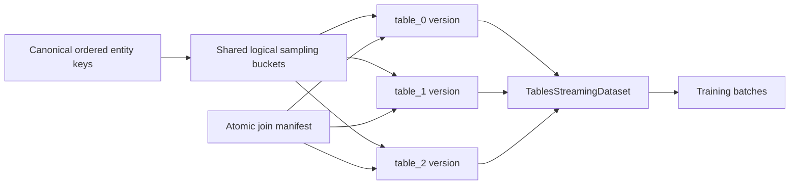

# TablesStreamingDataset

## Product and implementation plan

Status: proposed design
Audience: LitData users, ML infrastructure engineers, LitData maintainers
Scope: independently versioned tables that describe the same training entity and must be joined while streaming

## Executive summary

`TablesStreamingDataset` is intended for datasets in which:

- Several tables or modalities describe the same logical entity.
- One or more large tables are stable and expensive to rebuild.
- Smaller tables change more often, including schema-level changes.
- Training still requires the throughput, distributed sampling, shuffle, prefetch, cache locality, and checkpoint-resume behavior of an optimized LitData dataset.

The core design is **co-partitioned column families with an atomic version manifest**.

The central constraint cannot be removed: if tables are not joined before training, they must remain aligned by key in the storage layout. Otherwise, every sampled key requires unrelated random reads from every table, turning prefetch into a distributed query-planning problem.

The work is split into two deliberately different phases:

- **Phase V1 — strict aligned LitData chunks.** Every table is a normal optimized LitData dataset with exactly the same logical chunk boundaries, item counts, and key order. `TablesStreamingDataset` validates the layout and reuses `ParallelStreamingDataset`. This minimizes new read-path code and preserves existing LitData behavior.
- **Phase V2 — logical partitions with independently compacted column families.** Logical sampling buckets remain aligned, but physical files no longer need a one-to-one correspondence. Small tables can pack many logical partitions into larger Parquet or LitData objects, while large tables keep appropriately sized binary chunks. V2 introduces one shared sampler and a coordinated multi-table reader.

The public read API is designed once and remains stable across both phases. V2 is primarily an internal storage and reader improvement.



## 1. Problem

The current high-throughput LitData workflow materializes the complete training sample before or during `optimize()`. This is efficient at training time because one sample is stored in one streaming layout, but it couples the lifecycle of every source table:

1. A small table changes.
2. The joined sample schema changes.
3. The complete optimized dataset is rebuilt.
4. Large unchanged tables are read, serialized, and uploaded again.

`dataset_update` is complementary but does not solve the schema-change case. It is useful when a bounded set of existing samples can be replaced under a compatible optimized schema. If every entity in a table gains or loses columns, that table must be re-optimized.

The target behavior is:

1. Optimize all required tables together from one ordered input stream so chunk alignment is guaranteed.
2. Later, update (or add) one table with `join_update_optimize`, validating against the existing chunk alignment.
3. Atomically publish a new combination of table versions.
4. Stream the selected versions as one training sample.
5. Preserve deterministic shuffle, DDP sharding, DataLoader workers, prefetch, caching, and exact resume.

## 2. Why alignment is required

LitData chunks are both:

- Physical I/O units downloaded and cached by `BinaryReader`.
- Sampling buckets assigned to ranks and workers.

The current sampling path has two stages:

1. Chunks are assigned and shuffled across ranks and DataLoader workers.
2. Item positions are shuffled within each selected chunk.

If separately optimized tables have different chunk boundaries or key order, the same seed does not make them align.

Without alignment, one sampled key needs a location in every table:

```text
entity-123:
  table_0 -> chunk 42, offset 731
  table_1 -> chunk 3,  offset 18
  table_2 -> chunk 91, offset 204
```

Successive shuffled keys are likely to reference unrelated object combinations. The system then needs to:

1. Resolve every key in every table.
2. Plan downloads across unrelated chunks.
3. Deduplicate and prioritize those downloads.
4. Coordinate cache admission and eviction.
5. Preserve distributed sampling and exact resume.
6. Join the decoded values.

That is closer to implementing a distributed feature store or query engine than extending a streaming dataset.

With alignment, one location is valid for every table:

```text
entity-123 -> logical bucket 42, position 731
```

The reader can fetch bucket group `42`, apply one item permutation, and read position `731` from every table.

## 3. Terminology

- **Entity key:** Stable identifier used to correlate tables, such as `entity_id`.
- **Canonical key order:** Immutable ordered sequence of entity keys for one layout.
- **Logical item:** One training entity in the canonical order.
- **Table sample:** The value contributed by one table for one logical item.
- **Logical bucket:** Contiguous range of canonical item positions used as one sampling bucket.
- **Physical chunk or object:** File downloaded from local or object storage.
- **Table version:** Immutable physical representation of one table under one canonical layout.
- **Snapshot:** Immutable manifest selecting exactly one version of every active table.
- **Active manifest:** Small `join.json` document pointing to the active snapshot.
- **Layout ID:** Content-derived identifier for the canonical key order and logical bucket boundaries.

## 4. Cardinality model

Phase V1 uses a strict **one logical table sample per entity key** contract.

This does not require every source table to contain one physical row per key. A table sample may contain:

- One scalar or dictionary.
- A tensor.
- A list of rows.
- A variable-length NumPy array.
- An Arrow-like or serialized tabular bundle.
- An explicit empty collection when that table has no source rows for the entity.

For example, a nested events table may contribute a variable-length bundle containing every event row for one parent entity. The logical join remains one-to-one even though the source table is one-to-many.

V1 rejects:

- A missing logical table sample.
- Duplicate logical entity keys.
- Filtering that removes an entity.
- A generator that emits zero or multiple logical samples for one input key.

An empty table contribution must be represented as an explicit empty value. This keeps every table positionally aligned.

**Runtime rule for builders:** In V1, a table builder must return exactly one serializable Python value for each input item. Returning `None` is always rejected and is not a representation of an empty contribution. Nullable payloads use an explicit envelope such as `{"value": None}`. Zero-row payloads use `[]`, `{}`, or a typed empty array such as `np.empty((0,), dtype=np.float32)`.

A builder exception aborts the whole job and prevents snapshot publication, even if other table writers already produced partial local output.

V2 can add a native offset-based representation for zero-to-many rows per key, but the canonical entity key and logical bucket alignment remain mandatory.

## 5. Design goals

### Correctness

- Never silently combine values from different entity keys.
- Validate alignment before a table version can become active.
- Pin every training run to an immutable snapshot.
- Resume only against the same snapshot and sampling configuration.
- Fail closed when metadata is missing, incompatible, or ambiguous.

### Performance

- Keep the iterative training path sequential and prefetchable.
- Avoid per-sample key lookups during normal training.
- Reuse existing LitData downloader, cache, serializers, item loaders, and shuffle behavior in V1.
- Avoid reading or rewriting unchanged table versions.
- Preserve direct object-store access for S3, GCS, R2, and Lightning Storage paths.

### Operability

- Publish a table version immutably.
- Publish a new snapshot atomically only after validation.
- Allow instant rollback to a previous snapshot.
- Keep failed or incomplete versions unreachable.
- Expose clear diagnostics for alignment and manifest failures.

### API quality

- Write path feels like `optimize`: one distributed `join_optimize(...)` job writes all selected tables from a single ordered input stream.
- Single-table updates (replace or add) use `join_update_optimize(...)`, which validates against the persisted layout.
- Public vocabulary is consistent: `TablesStreamingDataset`, `join_optimize`, `join_update_optimize`, `validate_tables_dataset`, `TableBuild`, `Tables*Error`.
- `key_fn` always receives the original input item, never a table output.
- No long-lived writer context manager.
- No required `key_name` / schema-field argument.
- A simple root-path read API with named table outputs.
- One shared set of sampling options.
- No need for users to configure `align_chunking`, `reorder_files`, child seeds, or child cache directories.
- The same user-facing read API in V1 and V2.

## 6. Non-goals

The following are not goals of V1:

- Arbitrary SQL joins at training time.
- Joining independently optimized legacy datasets without a one-time aligned rebuild.
- Different key populations per required table.
- Independent per-table shuffle.
- Byte-based chunking for aligned table versions.
- Dynamic filtering in one table.
- Many-to-many joins.
- Replacing `dataset_update`.
- Replacing a feature store or query engine.
- Automatically changing the canonical key population without rebuilding all table versions.

The full baked dataset remains the recommended default when all tables normally change together or when maximum simplicity and minimum object count are more important than independent table versioning.

## 7. Stable public API

The API below is the target public contract. Some advanced storage arguments become effective only in V2, but normal training code does not change.

There is no `TablesWriter` context manager and no `key_name` argument.

Alignment is enforced at write time by construction for the initial build: **one** `join_optimize` job walks a single ordered `inputs` stream and writes every selected table under its own subpath. Independent per-table optimize jobs with separate input lists are rejected as the primary API because they cannot guarantee the same entity order or chunk boundaries.

### 7.1 Initial build with `join_optimize`

Canonical public form: a `tables` mapping of builders (or `TableBuild` configs). There is no dual `fn=` / `fns=` create API in V1.

```python
from litdata import TableBuild, join_optimize

join_optimize(
    inputs=canonical_inputs,
    output_dir="s3://bucket/tables-dataset",
    key_fn=lambda item: item["entity_id"],
    chunk_size=2048,
    tables={
        "images": TableBuild(fn=build_images, compression="zstd"),
        "labels": TableBuild(fn=build_labels, compression="zstd"),
        "metadata": TableBuild(fn=build_metadata),
    },
    num_workers=32,
    num_nodes=8,
    snapshot="baseline",
)
```

Callables are accepted as shorthand and normalized to `TableBuild` internally:

```python
tables={
    "images": build_images,
    "labels": build_labels,
}
```

`join_optimize` accepts the same core knobs as `optimize` (`inputs`, `output_dir`, `chunk_size`, `key_fn`, `num_workers`, `num_nodes`, `storage_options`, …) plus:

- `tables`: ordered mapping `{name: TableBuild | Callable}`. Insertion order becomes the snapshot `table_order`.
- `version` / per-table versions: optional; default is an auto-generated unique version shared by all tables in the job, or a mapping `{table: version}`.
- `snapshot`: optional human-readable snapshot name to publish on success.
- `expected_snapshot`: optional concurrency guard when updating an existing root.

#### `key_fn` contract

`key_fn(input_item)` extracts the canonical entity key from the **source input item before any table builder runs**. It is invoked exactly once per logical input entity. Table outputs are **not** required to contain the key. A later schema change may remove or rename an ID field inside a table without changing alignment behavior.

#### Semantics

- One distributed-capable job, same execution model as `optimize` (workers, nodes, upload, index merge).
- For each input item, every table builder in `tables` is invoked with that same item and must return exactly one serializable non-`None` value.
- `input_item` is shared **read-only** input. Mutating it inside a builder is unsupported behavior (later builders must not observe different data).
- The job uses one canonical input order. All tables share entity order, global indexes, `chunk_size` boundaries, and within-chunk key order **by construction**.
- Chunks land under `tables/{table}/{version}/` with separate `index.json` files, identical item counts per chunk index.
- `chunk_size` is required (item count). `chunk_bytes` is rejected for join writes.
- Root-level `compression` / `encryption` apply as defaults; per-table `TableBuild` fields override them.
- On success the job writes the shared layout, **proves normalized entity-key uniqueness**, validates alignment metadata, and atomically publishes `join.json`.
- Failed jobs leave the previous active snapshot unchanged. They may leave unreferenced staging objects under unique version prefixes; those are never valid without a completion marker and snapshot reference. GC removes them only after the configured safety window.
- Initial layout creation is **conditional**. A `join_optimize` job may initialize a root only if no active manifest and no completed layout exist. The backend must use an exclusive create, generation precondition, or publisher lease. If another initializer wins, the losing job fails with `TablesCommitConflictError`.
- Adding a table to an existing layout uses `join_update_optimize` (see 7.3).

### 7.2 Why not one optimize call per table

```python
# Rejected as the primary write API
optimize(..., inputs=inputs_0)  # into tables/table_0/...
optimize(..., inputs=inputs_1)  # into tables/table_1/...
```

Separate input lists or separate distributed schedules can diverge in order, filtering, retries, or worker assignment. Digests can detect mismatch after the fact, but they cannot invent a shared chunk layout. V1 therefore builds alignment by writing all tables together in one `join_optimize` job.

### 7.3 Update or add one table with `join_update_optimize`

| Operation                             | Alignment property                                                |
| ------------------------------------- | ----------------------------------------------------------------- |
| `join_optimize` initial build         | Guaranteed by one canonical traversal and synchronized writers    |
| `join_update_optimize`                | Validated against the persisted canonical layout                  |
| Future layout-driven update (post-V1) | Guaranteed by streaming persisted layout keys through `lookup_fn` |

`join_update_optimize` does **not** infer or repair entity order. It validates that the provided input stream reproduces the persisted layout exactly. A key mismatch, missing entity, duplicate displacement, extra entity, or different final length fails the job before snapshot publication.

```python
from litdata import join_update_optimize

join_update_optimize(
    inputs=canonical_inputs,
    output_dir="s3://bucket/tables-dataset",
    table="metadata",
    fn=build_metadata_v2,
    key_fn=lambda item: item["entity_id"],
    version="v2",
    base_snapshot="baseline",
    expected_snapshot="baseline",
    snapshot="metadata-v2",
    num_workers=8,
)
```

Semantics:

- Reads `base_snapshot` (default: the active snapshot observed at job start) and its canonical layout.
- In V1, `base_snapshot` identifies both the input dependency set and the snapshot from which sibling table versions are inherited. When `expected_snapshot` is provided, it **must equal** `base_snapshot`. Publication succeeds only if the active snapshot still equals that value at compare-and-swap time. Differing values are rejected because it would be unclear which snapshot supplies inherited siblings, and a merge from a stale base could silently discard newer sibling updates. A stale base always raises `TablesCommitConflictError`; LitData does not perform automatic snapshot merges.
- `key_fn` always receives the original input item (read-only).
- Forces the layout `chunk_size` and aligned write settings.
- Writes only `tables/{table}/{new_version}/`.
- During the write, every work unit validates by **streaming** expected keys for its assigned contiguous global-index range (not random per-item metadata lookup):

```python
for global_index, expected_key, input_item in zip(
    assigned_positions,
    layout.iter_keys(start=range_start, stop=range_stop),
    assigned_inputs,
):
    actual_key = key_fn(input_item)
    if actual_key != expected_key:
        raise TablesAlignmentError(
            table=table,
            global_index=global_index,
            expected_key=expected_key,
            actual_key=actual_key,
        )
```

The conceptual `layout.key_at(global_index)` idea is implemented as sequential `layout.iter_keys(start, stop)` over each assigned range. Implementations must not perform one remote random key-index lookup per input item.

- At stream end for each range / overall: fail if inputs ended early (missing expected position) or continued past layout length (extra input).
- After merge, also verify length, chunk counts, per-chunk item counts, and ordered-key digests (compact completion / deep-validation metadata).
- Uniqueness is **not** recomputed on update/add if the base layout was already validated as unique; sequential reproduction is sufficient.
- On success, publishes a new snapshot that inherits sibling versions from `base_snapshot` and points `table` at the new version.
- Reject overwrite of an existing published version path before writing.
- Reject `fn` returning `None` immediately.
- On any failure, leave no completion marker and do not advance `join.json`. Failed jobs may leave unreferenced staging objects under the unique version prefix; they are unreachable without a completion marker and snapshot reference.

#### Adding a new table (supported in V1)

```python
join_update_optimize(
    inputs=canonical_inputs,
    output_dir=root,
    table="new_table",
    fn=build_new_table,
    key_fn=lambda item: item["entity_id"],
    base_snapshot="baseline",
    expected_snapshot="baseline",
    snapshot="snap-add-new-table",
)
```

Adding a table creates a new snapshot containing inherited sibling versions plus the new table. Existing snapshots remain valid and do **not** retroactively gain the table. A reader requesting a table absent from its pinned snapshot raises during construction (`TablesManifestError`).

`table_order` for the new snapshot is the previous order with the new table appended.

#### Future layout-driven update (out of scope for V1)

```python
# Post-V1 sketch — alignment by construction for updates
join_update_optimize(
    output_dir=root,
    base_snapshot="baseline",
    table="metadata",
    lookup_fn=lookup_entity,  # key -> source payload
    fn=build_metadata_v2,
    version="v2",
)

# layout position i -> key ki -> lookup_fn(ki) -> table builder
```

V1 still requires users to supply `inputs` in layout order. Documenting this future mode clarifies the long-term path without expanding V1 scope.

`expected_snapshot` / `snapshot` / `base_snapshot` are **human-readable names**, not hashes of chunk bytes.

#### Concurrency example

```python
# Valid: base and expected are the same parent
join_update_optimize(..., base_snapshot="baseline", expected_snapshot="baseline", ...)

# Rejected in V1: unclear inheritance / possible silent sibling loss
join_update_optimize(..., base_snapshot="baseline", expected_snapshot="metadata-v2", ...)
```

### 7.4 Stream the active snapshot

```python
from litdata import TablesStreamingDataset, StreamingDataLoader

dataset = TablesStreamingDataset(
    "s3://bucket/tables-dataset",
    tables=("images", "labels", "metadata"),
    shuffle=True,
    seed=42,
    drop_last=True,
    transform=lambda parts: {
        **parts["images"],
        **parts["labels"],
        **parts["metadata"],
    },
    max_cache_size="200GB",
    max_pre_download=4,
)

loader = StreamingDataLoader(
    dataset,
    batch_size=64,
    num_workers=8,
)
```

Default output without `transform`:

```python
{
    "images": <images sample>,
    "labels": <labels sample>,
    "metadata": <metadata sample>,
}
```

The table namespace is preserved by default. LitData does not implicitly merge dictionaries because duplicate field names would otherwise be ambiguous.

### 7.5 Pin an exact snapshot

```python
dataset = TablesStreamingDataset(
    "s3://bucket/tables-dataset",
    snapshot="baseline",
    tables=("images", "labels", "metadata"),
    shuffle=True,
    seed=42,
)
```

Useful properties:

```python
dataset.snapshot_id
dataset.layout_id
dataset.table_versions
dataset.tables
```

### 7.6 Select only required tables

```python
dataset = TablesStreamingDataset(
    root,
    tables=("images", "metadata"),
)
```

Selection changes which column families are downloaded, but it does not alter canonical sampling order.

Unknown, duplicated, or inactive table names raise a clear error during construction.

### 7.7 Per-table decoding options

Sampling options cannot vary by table. Decoding-specific options may:

```python
dataset = TablesStreamingDataset(
    root,
    tables=("images", "metadata"),
    table_options={
        "images": {"encryption": images_key},
        "metadata": {"serializers": custom_serializers},
    },
)
```

The following are always shared and cannot appear in `table_options`:

- `shuffle`
- `seed`
- `drop_last`
- `subsample`
- epoch
- number of DataLoader workers
- distributed rank and world size

Batch size is owned by `StreamingDataLoader`, not by each child `StreamingDataset`. The invariant is that all children observe the same DataLoader / worker topology and therefore the same batch semantics.

### 7.8 Validate without training

```python
from litdata import validate_tables_dataset

report = validate_tables_dataset(
    "s3://bucket/tables-dataset",
    snapshot="baseline",
    deep=True,
)

report.raise_for_errors()
```

Validation levels:

- Construction always performs mandatory constant-size metadata validation.
- `deep=False` verifies manifests, table indexes, counts, layout IDs, `table_order`, and alignment roots.
- `deep=True` streams partition alignment metadata and verifies every ordered-key digest.
- `join_optimize` / `join_update_optimize` success always performs the validation required to prove published table(s) match the canonical layout.

### 7.9 Keyed debugging access

```python
sample = dataset.get_by_key("entity-123")
```

Keyed lookup is intended for inspection, debugging, and bounded retrieval. It is not used by the iterative training path.

For integer entity keys, `get_by_key()` remains explicit so integer positional indexing is unambiguous.

## 8. Common storage and snapshot model

The root is a versioned store:

```text
tables-dataset/
  join.json
  snapshots/
    baseline.json
    metadata-v2.json
  layouts/
    layout-entity-v1/
      index.json
      keys/
        shard-00000.parquet
        shard-00001.parquet
      partitions.parquet
  tables/
    images/
      v1/
        index.json
        alignment.parquet
        chunk-0-0.bin
        ...
    labels/
      v1/
        index.json
        alignment.parquet
        chunk-0-0.bin
        ...
    metadata/
      v1/
        index.json
        alignment.parquet
        chunk-0-0.bin
        ...
      v2/
        index.json
        alignment.parquet
        chunk-0-0.bin
        ...
```

### 8.1 Active manifest

`join.json` is small and published last:

```json
{
  "format": "litdata-tables-dataset",
  "format_version": 1,
  "active_snapshot": "metadata-v2",
  "updated_at": "2026-08-17T10:42:11Z"
}
```

### 8.2 Immutable snapshot

```json
{
  "format": "litdata-tables-snapshot",
  "format_version": 1,
  "snapshot_id": "metadata-v2",
  "parent_snapshot_id": "baseline",
  "created_at": "2026-08-17T10:42:10Z",
  "layout": {
    "id": "layout-entity-v1",
    "path": "layouts/layout-entity-v1",
    "key_type": "string",
    "length": 1000000000,
    "chunk_size": 2048,
    "num_chunks": 488282,
    "alignment_root": "blake2b-256:..."
  },
  "table_order": ["images", "labels", "metadata"],
  "tables": {
    "images": {
      "version": "v1",
      "path": "tables/images/v1",
      "format": "litdata",
      "layout_id": "layout-entity-v1",
      "alignment_root": "blake2b-256:...",
      "schema_fingerprint": "sha256:..."
    },
    "labels": {
      "version": "v1",
      "path": "tables/labels/v1",
      "format": "litdata",
      "layout_id": "layout-entity-v1",
      "alignment_root": "blake2b-256:...",
      "schema_fingerprint": "sha256:..."
    },
    "metadata": {
      "version": "v2",
      "path": "tables/metadata/v2",
      "format": "litdata",
      "layout_id": "layout-entity-v1",
      "alignment_root": "blake2b-256:...",
      "schema_fingerprint": "sha256:..."
    }
  }
}
```

`table_order` is explicit and immutable within a snapshot. JSON object key order is not relied upon for:

- `ParallelStreamingDataset` child ordering;
- state-dict compatibility;
- transform / diagnostics determinism;
- manifest serialization stability.

Rules:

- Snapshot `table_order` lists every active table exactly once.
- Dataset `tables=(...)` is an ordered selection from that set.
- State dict records the requested table order; reordering selected tables is state-incompatible unless the caller explicitly starts a new data epoch.
- Default named output preserves the requested selection order.
- Adding a table appends it to `table_order` in the new snapshot.

All paths are relative to the root in V1. Manifest parsing rejects:

- Absolute paths.
- Parent traversal.
- A different URI scheme or bucket.
- Duplicate normalized table names.
- Missing / inconsistent `table_order`.
- Unknown format versions.

This keeps one snapshot within one trust and credential boundary.

### 8.3 Canonical layout

The layout is immutable and contains:

- Canonical entity key type and order.
- Global item count.
- Logical bucket size.
- Tail bucket size.
- Per-bucket global start and stop positions.
- Per-bucket ordered-key digest.
- A digest root covering the complete ordered layout.
- A key index for debugging lookup and table re-optimization.

The key store must be sharded and streamed. Creating or validating a billion-row layout must not require a Python dictionary containing every key.

The canonical key order, rather than lexical key order, defines training positions. Key-index shards may be physically sorted or hash-partitioned for lookup as long as the stored `global_index`, `chunk_index`, and `chunk_offset` preserve the canonical order.

The layout key store must expose efficient sequential range iteration for update validation:

```python
layout.iter_keys(start: int, stop: int)  # contiguous global indexes
```

`get_by_key()` may use a separately optimized key-sorted or hash-partitioned index. That debugging path is distinct from sequential update validation.

### 8.3.1 Initial key uniqueness (required before first publish)

Encounter-order recording alone does not prove uniqueness. An accidental duplicate in the initial layout would still be reproducible by later updates and would match digests.

Before an initial snapshot is published, the canonical layout builder must prove that every normalized entity key occurs **exactly once**. At billion-row scale this cannot use an in-memory Python set. Suitable approaches:

1. **External sort validation** — emit `(normalized_key, global_index)` records, externally sort by key, detect adjacent equals, report both positions.
2. **Hash partition plus local sort** — hash-partition keys into bounded shards, sort each shard, detect duplicates within each shard.
3. **Existing scalable key-index infrastructure** — if LitData already has a distributed sorted key index, use it as the uniqueness authority.

Canonical training order remains encounter order. Sorting is only for uniqueness verification and keyed lookup index construction.

```text
TablesAlignmentError:
  duplicate entity key: "entity-123"
  first_global_index: 1024
  duplicate_global_index: 8439921
  layout_id: layout-entity-v1
```

Update and add-table jobs do not recompute uniqueness when the base layout was already validated.

### 8.4 Identifiers vs digests

Three different identifiers appear in the format. They must not be confused:

- **Snapshot ID** (for example `snap-baseline`): a human-readable name for one published combination of table versions. Assigned when a `join_optimize` or `join_update_optimize` job publishes successfully (create, replace, or add-table). It is **not** a hash of chunk bytes.
- **Table version** (for example `v1`, `v2`): a human-readable name for one immutable build of a single table.
- **Ordered-key digest / alignment root**: a compact fingerprint of the **canonical entity-key order** inside each logical bucket. Used only to prove tables are aligned. LitData does **not** compute content hashes of chunk payloads for this purpose.

### 8.5 Digest encoding

Digest computation (for ordered keys only) must be deterministic across Python versions and machines:

1. Normalize the key to the supported integer or UTF-8 string representation.
2. Prefix each key with a type tag.
3. Prefix variable-length bytes with an explicit fixed-width length.
4. Hash keys in canonical order.
5. Include bucket index, start position, and item count in the bucket digest.
6. Hash the ordered bucket metadata into the layout alignment root.

The initial algorithm is `BLAKE2b-256`. The manifest stores the algorithm and canonical encoding version so a future algorithm can coexist without ambiguity.

Using `str(key)` concatenation without type and length framing is not acceptable because it can create ambiguous encodings.

### 8.6 Table alignment metadata

Every table version contains an `alignment.parquet` sidecar with:

- `chunk_index`
- `global_start`
- `num_items`
- `ordered_key_digest`

The table `index.json` gains a backward-compatible `tables_dataset` section:

```json
{
  "tables_dataset": {
    "format_version": 1,
    "table": "metadata",
    "table_version": "v2",
    "layout_id": "layout-entity-v1",
    "length": 1000000000,
    "num_chunks": 488282,
    "alignment_root": "blake2b-256:..."
  }
}
```

Per-chunk digests live in compact Parquet rather than expanding an already large `index.json`. Normal dataset construction compares constant-size roots. Deep validation reads the Parquet sidecars.

## 9. Atomic publication and reader isolation

### 9.1 Publication protocol

Each successful `join_optimize` / `join_update_optimize` publishes as part of the same job (no separate writer `commit()`):

01. Read and retain the expected active snapshot when `expected_snapshot` is set.
02. Write new table data to unique immutable version path(s) under `tables/{table}/{version}/`.
03. Upload all chunk objects (existing multi-worker / multi-node optimize upload path).
04. Upload table alignment metadata for every rewritten table.
05. Upload each rewritten table `index.json` and completion marker last.
06. For an initial `join_optimize`, publish the shared layout from the single ordered `key_fn` stream over canonical inputs.
07. Validate rewritten table(s) against the layout (position checks during update; counts + per-chunk ordered-key digests at completion).
08. Write a new immutable snapshot document: the base snapshot's table set plus newly written or replaced table versions (`table_order` preserved; new tables appended).
09. Recheck the active snapshot or storage generation.
10. Atomically replace `join.json` with the new active snapshot.

If any operation fails before step 10, the active snapshot remains unchanged. Failed jobs may leave unreferenced staging objects under unique version prefixes; they are never considered valid without a completion marker and snapshot reference. Garbage collection removes them only after the configured safety window.

Jobs remain distributed-capable like `optimize`. There is no process-local writer session holding uncommitted state across tables outside the single job.

### 9.2 Backend behavior

- Local files use a temporary file, `fsync` where appropriate, and `os.replace`.
- S3 and R2 use immutable version objects and a conditional active-manifest write where supported.
- GCS uses generation-match preconditions.
- A backend without safe compare-and-swap must use a single-publisher lease or fail closed for concurrent publication.

The storage abstraction must expose the precondition required for `expected_snapshot`; a read-then-unconditional-write sequence is not sufficient to prevent lost updates.

### 9.3 Reader behavior

`TablesStreamingDataset` resolves the active snapshot exactly once during construction. It never polls `join.json` during iteration.

Therefore:

- Existing training jobs continue reading the old immutable table paths.
- New training jobs see the newly active snapshot.
- No job sees a mixture of old and new table versions.
- Checkpoint state records the snapshot ID.
- Resume against a different snapshot fails unless the caller explicitly opts to start a new data epoch.

## 10. Phase V1 — strict aligned LitData chunks

### 10.1 V1 objective

Deliver a safe, production-testable implementation with the smallest possible change to LitData’s proven training read path.

In V1:

- Every table version is a standard optimized LitData dataset.
- One physical LitData chunk is one logical sampling bucket.
- Corresponding table chunks contain the same keys in the same order.
- Chunk byte sizes, schemas, compression, serializers, and payload types may differ.
- `TablesStreamingDataset` is a validated named wrapper around `ParallelStreamingDataset`.

### 10.2 V1 hard invariants

For every active table:

01. `layout_id` matches the snapshot layout.
02. Total logical length matches.
03. Number of chunks matches.
04. Chunk `i` has the canonical item count.
05. Chunk `i` has the canonical ordered-key digest.
06. The final partial chunk appears in the same position.
07. Every canonical key appears exactly once.
08. No additional key appears.
09. One input produces one logical table sample.
10. Table paths and versions are immutable.

For the read configuration:

1. All children receive the same `shuffle`.
2. All children receive the same `seed`.
3. All children receive the same epoch.
4. All children receive the same `drop_last`.
5. All children receive the same `subsample`.
6. All children see the same distributed environment.
7. All children observe the same DataLoader worker topology and batch semantics (batch size is owned by the DataLoader).
8. A loaded state dict references the same snapshot and ordered table list.

### 10.3 V1 write path

#### Canonical input planning (required capability)

The indexing invariant below is not implementable for an arbitrary Python generator without materializing or indexing the input stream. V1 therefore requires inputs that support deterministic planning:

1. A deterministic **indexable sequence** (list-like: `__len__` + positional access); or
2. A deterministic **shard manifest** whose shard order and per-shard item order are fixed, from which LitData can derive canonical global-index ranges before workers execute; or
3. A previously materialized **canonical input plan** produced by LitData.

**Policy:** distributed `join_optimize` / `join_update_optimize` requires deterministic static inputs. Arbitrary generators / streaming iterables are rejected unless running locally with `num_workers=1` and `num_nodes=1`.

Optional helpers (same semantics):

```python
plan = create_canonical_input_plan(
    inputs=inputs,
    key_fn=lambda item: item["entity_id"],
    output_dir=root,
)
join_optimize(inputs=inputs, input_plan=plan, ...)
```

Without this contract, preassigning `work unit 0 -> positions 0..16383` remains aspirational rather than enforceable.

#### Canonical distributed indexing (hard invariant)

Before table builders execute, `join_optimize` / `join_update_optimize` deterministically assigns **canonical global-index ranges and complete logical chunks** to work units from the input plan. A retry retains the same assigned range. Worker completion order never determines canonical layout order or chunk numbering.

```text
canonical input positions:
  work unit 0 -> chunks 0..7
  work unit 1 -> chunks 8..15
  work unit 2 -> chunks 16..23
```

Not:

```text
worker 0 -> whichever inputs it happens to receive next
worker 1 -> whichever inputs it happens to receive next
```

Each distributed work unit owns fixed ranges of global positions. Within a range, the worker invokes every selected table builder for each input item and writes each table contribution at the same logical position. Outputs are merged by canonical chunk index, never task completion order.

V1 must not rely on workers independently calling `enumerate(inputs)`, queue scheduling, task stealing, shard-discovery order, or completion order to define layout positions.

#### `join_optimize` (initial multi-table build)

One optimize-style job opens one writer per table under `tables/{table}/{version}/` and advances them together:

- Deterministic partition of planned canonical input positions into complete chunk ranges.
- Shared `chunk_size` flush points: when the item count hits `chunk_size`, every table writer closes its current chunk.
- Shared `key_fn(input_item)` stream recorded once into the layout.
- Scalable uniqueness validation before first publish (see 8.3.1).
- `align_chunking=True`, `reorder_files=False`, `keep_data_ordered=True`.
- `num_nodes` / Studio multi-node execution works like `optimize`.
- Conditional root initialization (exclusive create / lease / generation precondition).

Because chunk boundaries and indexes are assigned before builders run, tables cannot drift.

#### `join_update_optimize` (single-table rewrite or add)

A later job rewrites or adds one table subpath:

- Loads the existing layout's length, `chunk_size`, and alignment metadata.
- Uses the same canonical range assignment model as create.
- Streams `layout.iter_keys(start, stop)` for each assigned range and compares against `key_fn(input_item)` sequentially (fail immediately on first mismatch).
- Writes `tables/{table}/{new_version}/` with the same chunk item counts.
- Rejects the publish if any position, digest, or length differs from the layout.
- Does not recompute global uniqueness against the base layout.

This is how a schema change on one table avoids rewriting siblings while still keeping native bucket sampling. Adding a table uses the same validation path and snapshot-merge publication.

#### Rejected / hidden settings

- `chunk_bytes`
- Independent per-table input lists as the primary create API
- Dual create APIs (`fn` returning a mapping **and** `fns=...`) — V1 uses only `tables={...}`
- Distributed jobs over arbitrary generators / non-plannable streaming iterables
- `weights` / shared dynamic work queues that reorder items
- `keep_data_ordered=False`, `reorder_files=True`
- filtering / variable-yield generators / builders returning `None`
- append into an existing table version / overwrite of a published version
- a `key_name` / schema-field argument
- `base_snapshot != expected_snapshot` when both are set

### 10.4 V1 read path

Construction:

1. Resolve the root through LitData’s normal path resolver.
2. Load and pin a snapshot.
3. Validate the snapshot and selected table metadata.
4. Create one `StreamingDataset` per selected table version.
5. Give every child identical sampling options.
6. Allocate a unique cache namespace per snapshot, table, and version.
7. Pass the children to `ParallelStreamingDataset`.
8. Adapt positional tuples to a named dictionary.

Iteration:

1. Existing `FullShuffle` computes the same chunk ordering for every child.
2. Existing worker assignment computes the same chunk intervals because chunk counts and item counts match.
3. Existing in-chunk shuffle computes the same item permutation.
4. Each child `BinaryReader` prefetches its corresponding chunks.
5. `ParallelStreamingDataset` pulls one aligned value from each child.
6. `TablesStreamingDataset` creates the named table mapping.
7. The optional transform creates the final training sample.

No key lookup occurs on this path.

### 10.5 Why existing shuffle remains aligned in V1

Corresponding children have identical:

- Chunk interval arrays.
- Number of chunks.
- Seed.
- Epoch.
- Chunk index.
- Worker and distributed topology.
- Batch and `drop_last` configuration.

As a result, both chunk-to-worker assignment and within-chunk permutation are deterministic and equal across children.

This must be proven with integration tests rather than assumed from unit-level seed equality.

### 10.6 V1 resume behavior

The state dict includes:

- Snapshot ID.
- Layout ID.
- Ordered table names and versions.
- Existing child `StreamingDataset` states.
- Current epoch.
- Per-worker yielded counts.
- Transform RNG state inherited from `ParallelStreamingDataset`.

On load:

- A different snapshot is rejected.
- A different selected table set or order is rejected.
- Existing LitData checks still reject incompatible seed, shuffle, worker count, batch size, item loader, or distributed world size.
- `force_override_state_dict` remains an advanced escape hatch and emits a strong warning because repeated or skipped samples are possible.

### 10.7 V1 cache and prefetch behavior

Each child keeps its existing:

- `BinaryReader`
- `PrepareChunksThread`
- Downloader
- Asynchronous remote prefetch
- Refcount and deletion logic

The wrapper does not introduce another download engine.

An explicit join cache root is namespaced:

```text
cache/
  <snapshot-id>/
    table_0/
      <version>/
    table_1/
      <version>/
```

This prevents same-named LitData chunk files from different tables from colliding.

In V1, `max_cache_size` is an **aggregate target** rather than a strict global limit. The wrapper derives per-table child budgets from table chunk-size estimates. Temporary overage is possible because existing child readers retain independent prefetch, refcount, and eviction behavior. V2 introduces strict shared aggregate cache ownership.

Peak in-flight storage is approximately:

```text
num_workers × max_pre_download × sum(corresponding table chunk bytes)
```

The slowest or largest member of a chunk group determines when that group is fully available.

### 10.8 V1 limitations

V1 intentionally accepts the following trade-offs:

- Every table has the same number of physical chunk objects.
- Tiny tables may produce many small objects.
- Object GET count is approximately multiplied by the number of selected tables.
- A single `chunk_size` must balance feature chunk bytes, sampling diversity, and small-table object count.
- The wrapper relies on several independently operating child prefetchers.
- Aggregate cache enforcement is approximate because children retain independent cache managers.
- Required tables must have the same logical key population.
- Changing the canonical key population requires a new layout and rebuilding all tables.
- Native per-key zero-to-many row ranges are not yet represented; V1 bundles them into one table sample.

These limitations are the primary motivation for V2.

### 10.9 V1 error model

Introduce specific public exceptions:

- `TablesDatasetError`
- `TablesManifestError`
- `TablesAlignmentError`
- `TablesSnapshotMismatchError`
- `TablesCommitConflictError`

An alignment error includes:

- Table name and version.
- Layout ID.
- Chunk or global index.
- Expected item count or key digest.
- Actual item count or key digest.
- Recommended remediation.

No warning-only mode is provided for alignment failures.

### 10.10 V1 implementation work

#### Manifest and layout utilities

Add `src/litdata/utilities/multi_join.py`:

- Typed dataclasses for active manifest, snapshot, layout, table version, and validation report.
- Strict JSON parsing and format-version checks.
- Relative-path validation.
- Canonical key encoding and digest computation.
- Streaming layout creation.
- Snapshot loading and publication helpers.
- Sharded key iteration without a full Python dictionary.

Do not add a heavy schema dependency solely for these small metadata models.

#### Write API

Add `join_optimize`, `join_update_optimize`, and `TableBuild` in `src/litdata/processing/functions.py` (re-exported from `__init__.py`):

- Same distributed execution path as `optimize` (`DataProcessor`, `num_nodes`, uploaders, index merge).
- `join_optimize`: `tables={name: TableBuild|callable}`, deterministic canonical chunk-range assignment, N synchronized writers, shared layout publish.
- `join_update_optimize`: one table writer (replace or add), position-by-position layout key checks, digest checks, snapshot merge publish.
- Force aligned write settings listed above.
- No writer context manager.

Extend the optimize internals where necessary to:

- Assign canonical global-index / chunk ranges to work units before builders run; retries keep the same ranges; merge by chunk index.
- Fan out one input item to multiple table caches / writers.
- Synchronize chunk closes across table writers on item-count boundaries.
- Call `key_fn` once per input item before builders; stream ordered `(global_index, key)` into the layout.
- On update, compare keys at every global index and fail immediately on mismatch.
- Attach the backward-compatible `tables_dataset` section to each table `index.json`.
- Create the shared layout during the initial `join_optimize`.

Public modules may keep internal filenames such as `multi_join.py` initially; public names use the tables vocabulary.

Likely integration points:

- `src/litdata/processing/functions.py`
- `src/litdata/processing/data_processor.py`
- `src/litdata/streaming/writer.py`
- `src/litdata/streaming/cache.py`
- `src/litdata/utilities/keys_index.py`
- `src/litdata/utilities/multi_join.py` (internal; public API is tables-named)

#### Read API

Add `src/litdata/streaming/multi_join.py`:

- Manifest resolution.
- Mandatory alignment validation.
- Named child construction.
- Cache namespacing.
- Tuple-to-mapping transform adapter.
- Snapshot-aware state dict.
- Optional keyed debugging access.

Reuse:

- `src/litdata/streaming/parallel.py`
- `src/litdata/utilities/base.py`
- `src/litdata/streaming/dataset.py`
- `src/litdata/streaming/dataloader.py`
- `src/litdata/streaming/shuffle.py`
- `src/litdata/streaming/reader.py`

#### Storage publication

Extend `src/litdata/streaming/fs_provider.py` or a narrowly scoped manifest-storage abstraction with:

- Read object metadata or generation.
- Conditional active-manifest write.
- Immutable JSON upload.
- Local atomic replacement.

Training downloads continue to use `Downloader`; `FsProvider` must not be introduced into `PrepareChunksThread`.

#### Public exports

Update:

- `src/litdata/__init__.py`
- Public API documentation.
- The LitData skill and reference docs.

### 10.11 V1 correctness test matrix

Add focused tests under:

- `tests/processing/test_multi_join.py`
- `tests/streaming/test_multi_join.py`
- `tests/utilities/test_multi_join.py`

Cover:

- One, two, and many tables.
- Empty dataset rejection.
- Full and partial final chunks.
- Different table payload byte sizes.
- Different schemas and serializers.
- Different compression settings via `TableBuild`.
- Different optimize worker counts.
- Different optimize node counts.
- Stable boundaries with `align_chunking=True`.
- Key order mismatch.
- Missing key.
- Duplicate key.
- Extra key.
- Builder returning `None`.
- Variable-yield generator rejection.
- Corrupt layout ID.
- Corrupt per-chunk digest.
- Missing table `index.json`.
- Incomplete table version.
- Manifest path traversal.
- Unsupported manifest format version.
- Add-table snapshot merge; old snapshot cannot select the new table.
- Explicit `table_order` vs selection order / state incompatibility.
- Initial duplicate key detection (external-sort / hash-partition path).
- Distributed rejection of non-plannable generators.
- `base_snapshot != expected_snapshot` rejection.
- Concurrent initializer conflict.

Deterministic distributed write ordering:

- Workers complete canonical chunks in reverse order.
- A failed chunk is retried after later chunks complete.
- Different node counts produce identical layout digest and aligned chunk numbering.
- Worker assignment differs between create and update jobs.
- Source shard listing order differs but explicit canonical input position assignment remains stable.

Early update validation:

- First key mismatches at global index 0.
- Key mismatches at a chunk boundary.
- Key mismatches in the final partial chunk.
- Input ends before layout end.
- Input has one extra entity after layout end.
- Repeated key appears where a later canonical key is expected.
- Update builder emits `None`.
- Update builder raises midway through a chunk.
- Failure leaves no completion marker and no active-manifest change.

Read-path matrix:

- `shuffle=False` and `shuffle=True`.
- Multiple epochs.
- Seeds.
- DataLoader workers `0`, `1`, `2`, and a higher stress count.
- DDP world sizes and ranks.
- Chunk intervals split across workers.
- `drop_last=True` and `False`.
- Different batch sizes.
- Common subsampling.
- Persistent workers.
- Early break.
- Complete and partial checkpoint resume.
- Transform RNG resume.
- Cache pressure and eviction.
- Asynchronous remote prefetch on and off.

Snapshot tests:

- A reader opened before commit continues on the old snapshot.
- A reader opened after commit sees the new snapshot.
- `table_0` objects are not rewritten by a `table_1`-only update.
- Rollback activates the previous immutable snapshot.
- Concurrent stale `join_optimize` / `join_update_optimize` publish fails.
- Failure before active-manifest publication leaves the old snapshot active.

Remote tests:

- S3-compatible mocked backend.
- R2 path resolution.
- Lightning Storage connection path resolution.
- GCS manifest generation behavior where available.
- Direct object access rather than hand-reading a FUSE mount.

### 10.12 V1 performance validation

Benchmark against a baked single LitData dataset using the same:

- Entity population and canonical order.
- Batch size.
- DataLoader workers.
- DDP topology.
- Cache disk.
- `max_pre_download`.
- Compression.
- Cold-cache and warm-cache conditions.

Measure:

- Time to first batch.
- Median and tail batch wait.
- Samples per second.
- GPU data-wait percentage.
- Object GET count.
- Bytes downloaded.
- Peak cache usage.
- CPU decode time.
- Cost and elapsed time to rebuild only the changed table.

No production throughput claim should be made before this benchmark runs on a representative multi-table workload. Correctness and independent table replacement are hard release gates; throughput is a measured release gate agreed against the baseline.

### 10.13 V1 completion criteria

V1 is complete when:

1. A two-table and a many-table dataset can be created through one `join_optimize` job.
2. Updating one table with `join_update_optimize` (or adding a table) does not write under unchanged sibling table-version prefixes.
3. A new table snapshot is atomically activated.
4. Old readers continue without observing mixed versions.
5. Every tested shuffle, worker, DDP, and resume configuration preserves key alignment.
6. Intentional misalignment fails before iteration.
7. The Lightning Storage end-to-end test is green.
8. Representative cold-cache benchmarks are documented.
9. API documentation includes creation, update, rollback, training, and troubleshooting.

## 11. Phase V2 — logical partitions and independent physical compaction

### 11.1 V2 objective

Remove V1’s requirement that every logical sampling bucket be a separate physical object in every table, while retaining canonical key alignment and deterministic bucket sampling.

V2 does **not** remove alignment. It separates:

- Logical sampling layout.
- Table-specific physical storage layout.

This permits small or schema-volatile tables to use an efficient physical representation without changing the training entity order.

### 11.2 Why V2 is needed

Assume the canonical bucket contains 2,048 entities:

- A large `table_0` bucket may be 64–256 MB.
- A small `table_1` bucket may be only tens or hundreds of KB.

V1 writes one object for each in both tables. At very large scale, a small table may have hundreds of thousands of tiny objects. This increases:

- Object listing and metadata cost.
- GET request count.
- Time to first batch.
- Index size.
- Cache bookkeeping.
- Publication and garbage-collection overhead.

V2 allows many small-table buckets to be packed into one appropriately sized object while preserving the original logical bucket boundaries for sampling.

### 11.3 V2 storage model

```text
tables-dataset/
  join.json
  snapshots/
  layouts/
    <layout-id>/
      index.json
      keys/
      partitions.parquet
  tables/
    table_0/
      <version>/
        table.json
        mapping.parquet
        objects/
          pack-00000.bin
          pack-00001.bin
    table_1/
      <version>/
        table.json
        mapping.parquet
        objects/
          pack-00000.parquet
          pack-00001.parquet
```

Each table’s `mapping.parquet` maps canonical logical buckets to physical storage:

- Logical bucket ID.
- Canonical global start and item count.
- Physical object path.
- Encoding or item-loader type.
- Byte, row-group, or row interval.
- Ordered-key digest.
- Optional per-key offset-vector location.

One physical object may contain several consecutive logical buckets.

V2 initially avoids splitting one logical bucket across many physical objects unless a single bucket exceeds the configured maximum. Supporting one object span per table per logical bucket keeps prefetch planning bounded.

### 11.4 Heterogeneous column families

V2 can support different physical formats behind one logical contract:

- LitData binary for large tensors, images, audio, or nested Python structures.
- Parquet for schema-volatile tabular data.
- A compact offset-based binary representation for variable-length rows.

Every format adapter must provide:

- Metadata loading.
- Physical dependency resolution for a logical bucket.
- Prefetch request generation.
- Loading a logical item by position.
- Resource release.
- Format-specific schema fingerprint.

The join sampler must not contain format-specific decode logic.

### 11.5 V2 read engine

V2 replaces the V1 `ParallelStreamingDataset` composition internally with a shared engine:

1. Load the canonical logical partition intervals once.
2. Run chunk-to-rank and chunk-to-worker assignment once.
3. Generate one within-bucket item permutation.
4. Resolve each selected table’s physical dependencies for upcoming buckets.
5. Deduplicate dependencies when several logical buckets share a physical object.
6. Prefetch the complete dependency group.
7. Apply the same item position to every table loader.
8. Return the named table mapping.

Potential internal components:

- `TablesChunksConfig`
- `TablesShuffle`
- `TablesReader`
- `PrepareJoinPartitionsThread`
- `ColumnFamilyLoader`
- `LitDataColumnFamilyLoader`
- `ParquetColumnFamilyLoader`

Existing `Downloader` implementations, async remote fetch, serializers, and cache locking should be reused wherever possible.

V2 must not use `FsProvider` on the training read path.

### 11.6 V2 cache behavior

The shared reader owns one aggregate cache budget:

- Cache keys include snapshot, table, version, and physical object.
- One downloaded packed object can satisfy several upcoming logical buckets.
- Admission and eviction use the shared future-use schedule.
- Refcounts cover all workers and all logical buckets referencing an object.
- Prefetch depth is measured in logical bucket groups, not independently per table.

This eliminates V1’s approximate per-child budget split.

### 11.7 V2 storage extension on `join_optimize` / `join_update_optimize`

Per-table physical packing lives on `TableBuild` / update kwargs while the logical layout stays shared:

```python
from litdata import TableBuild, join_optimize, join_update_optimize, TableStorage

join_optimize(
    inputs=inputs,
    output_dir=root,
    key_fn=lambda item: item["entity_id"],
    chunk_size=2048,
    tables={
        "images": TableBuild(
            fn=build_images,
            storage=TableStorage(format="litdata", target_chunk_bytes="256MB", pack_logical_chunks=False),
        ),
        "metadata": TableBuild(
            fn=build_metadata,
            storage=TableStorage(format="parquet", target_chunk_bytes="128MB", pack_logical_chunks=True),
        ),
    },
)

join_update_optimize(
    inputs=inputs,
    output_dir=root,
    table="metadata",
    fn=build_metadata_v3,
    key_fn=lambda item: item["entity_id"],
    storage=TableStorage(format="parquet", target_chunk_bytes="128MB", pack_logical_chunks=True),
)
```

The normal `TablesStreamingDataset` construction remains unchanged.

### 11.8 V2 variable-cardinality column families

After the shared reader and packed-object model are stable, V2 can represent source-table cardinality natively:

- Each logical key position maps to a start and stop row offset.
- An empty range represents no rows for that table and key.
- A non-empty range returns one or many rows as the table contribution.
- Duplicate source rows are valid within that range.
- Duplicate logical entity keys remain invalid.

This is similar to a compressed sparse row layout:

```text
logical keys:   [k0, k1, k2, k3]
row offsets:    [0, 3, 3, 8, 9]
rows for k0:    [0:3]
rows for k1:    [3:3]  -> empty
rows for k2:    [3:8]
rows for k3:    [8:9]
```

The entity sampler still chooses `k0..k3`; the table loader resolves the associated row slice without a hash join.

This feature should be staged after V2’s one-envelope-per-key implementation because it changes collation, memory bounds, and schema semantics.

### 11.9 V2 state and resume

V2 stores one canonical sampling state rather than one child state per table:

- Snapshot and layout ID.
- Epoch.
- Canonical bucket permutation.
- Worker assignment inputs.
- Current logical bucket.
- Consumed positions in the bucket.
- Shared transform RNG state.

Table versions are data dependencies of the snapshot, not independent samplers.

This reduces the possibility of child state divergence and makes the alignment contract explicit in code.

### 11.10 V2 failure behavior

- A missing physical object reports the table, version, logical bucket, and object.
- A corrupt mapping entry fails before returning a sample.
- A loader returning a different item count from the mapping fails the bucket.
- Repeated download failure follows existing LitData retry and timeout behavior.
- Partial table publication remains unreachable because snapshots reference only complete versions.
- Unsupported table formats fail during construction.

### 11.11 V2 implementation work

Add or evolve:

- `src/litdata/streaming/multi_join.py`
- `src/litdata/streaming/multi_join_reader.py`
- `src/litdata/streaming/multi_join_config.py`
- `src/litdata/streaming/multi_join_shuffle.py`
- `src/litdata/processing/multi_join.py`
- Format-specific column-family loaders.

Refactor the V1 implementation behind internal protocols so the public class and state schema can evolve without breaking user code.

### 11.12 V2 test matrix

In addition to all V1 correctness tests:

- Different physical object counts per table.
- Several logical buckets in one small-table object.
- Large object spanning upcoming worker buckets.
- Dependency deduplication.
- LitData binary plus Parquet in one snapshot.
- Row-group and byte-interval mapping.
- Shared aggregate cache eviction.
- Multiple workers referencing the same packed object.
- Resume in the middle of a packed object.
- Missing and corrupt mapping entries.
- Optional empty per-key row ranges.
- Variable-cardinality collation.
- Very large partition manifests.
- Bounded metadata memory usage.

### 11.13 V2 performance validation

Compare:

1. Baked single dataset.
2. V1 strict aligned physical chunks.
3. V2 independently compacted column families.

The expected V2 improvement is primarily:

- Fewer object GETs for small tables.
- Smaller index and file-management overhead.
- Better cache reuse across adjacent logical buckets.
- Better control over each table’s physical object size.

V2 must preserve V1’s correctness and independent-version benefits.

### 11.14 V2 completion criteria

V2 is complete when:

1. V1 read code runs unchanged against the public API.
2. Different table object counts are supported under one canonical layout.
3. One shared sampler controls all tables.
4. Packed small-table objects reduce object GET count on the representative workload.
5. Aggregate cache usage is bounded by the configured budget.
6. Resume reproduces exactly the same logical entity sequence.
7. Mixed LitData and Parquet column families pass local, cloud, worker, and DDP tests.
8. V2 meets the agreed throughput target relative to the baked baseline.

## 12. V1 and V2 boundary

The boundary is intentionally simple:

### V1 aligns physical chunks

```text
logical bucket 0 -> table_0 chunk 0 -> table_1 chunk 0
logical bucket 1 -> table_0 chunk 1 -> table_1 chunk 1
logical bucket 2 -> table_0 chunk 2 -> table_1 chunk 2
```

The existing LitData sampler and independent readers can be reused.

### V2 aligns logical buckets

```text
logical buckets 0..9:
  table_0 -> 10 objects
  table_1 -> 1 packed object
```

A new shared sampler and mapping-aware reader are required.

### What V2 still does not do

V2 does not accept arbitrary unrelated table sharding and repair it with per-sample random joins. Logical key order and bucket membership remain shared. This is the requirement that preserves predictable training I/O.

## 13. Migration workflow

### One-time migration

1. Choose `key_fn` over the **source input item** (`entity_id` or equivalent).
2. Build one ordered `inputs` stream that can feed every table builder.
3. Intentionally shuffle / curate that order before `join_optimize` when source order has structure.
4. Choose the logical bucket item count based primarily on the largest table's bytes and desired bucket sampling.
5. Run one `join_optimize` job with `tables={name: TableBuild(...)}` (local or multi-node).
6. Validate the published snapshot with `validate_tables_dataset`.
7. Benchmark against the current baked dataset.

### Small-table schema update or add-table

1. Keep existing sibling table versions as-is.
2. Run `join_update_optimize(..., table=..., version=..., base_snapshot=..., expected_snapshot=...)` with inputs in layout order and `key_fn(input_item)` checks.
3. Start new training jobs on the newly published snapshot.
4. Leave existing jobs pinned to their original snapshot (they cannot see newly added tables).

### Rollback

1. Select a known-good immutable snapshot.
2. Atomically update `join.json`.
3. Start new jobs.

No table data is copied during rollback.

### Canonical key population change

Adding or removing entity keys changes:

- Global indexes.
- Logical bucket membership.
- Chunk counts or tail.
- Ordered-key digests.

V1 therefore creates a new layout and rebuilds every table. This is a deliberate correctness boundary.

A future append-only layout extension could preserve complete existing buckets and add new buckets, but it requires separate sampling, snapshot, and resume semantics and is not included in the initial plan.

## 14. Operational guidance

### Version naming

- User-provided readable versions are accepted.
- Internally generated immutable IDs prevent collisions.
- Reusing an existing table version path is rejected.

### Retention and garbage collection

Initial behavior:

- Successful `join_optimize` / `join_update_optimize` jobs never delete previous table versions.
- Rollback remains possible while snapshots and versions are retained.
- Failed staging outputs are recorded as unreachable.

Later garbage collection:

1. Enumerate retained snapshots.
2. Mark referenced layouts and table versions.
3. Apply a minimum age safety window.
4. Delete only unreferenced immutable prefixes.
5. Support dry-run output before deletion.

Garbage collection is never part of `join_optimize` / `join_update_optimize` publication.

### Observability

Expose structured diagnostics for:

- Snapshot resolution.
- Selected table versions.
- Alignment validation duration.
- Per-table download bytes and latency.
- Prefetch queue depth.
- Cache hit and eviction counts.
- Bucket wait on the slowest table.
- Keyed debug lookup latency.

Tracing should identify table and version without including entity keys by default.

## 15. Risks and mitigations

### Silent positional mis-join

Risk: the most serious failure mode.

Mitigation:

- Canonical key registry.
- Per-bucket ordered-key digests.
- Alignment-root comparison.
- Validation before publication.
- Mandatory metadata validation on open.
- End-to-end tests that include the key in test payloads.

### Tiny-object explosion in V1

Risk: schema-small tables produce many tiny chunks.

Mitigation:

- Measure V1 object count and GET overhead.
- Keep V1 as the minimal safe implementation.
- Implement V2 physical packing if the measured cost is material.

### Cache multiplication

Risk: independent V1 child readers each reserve and prefetch data.

Mitigation:

- Namespace caches.
- Treat the public cache budget as an aggregate target in V1; strict shared ownership is V2.
- Allocate proportional child budgets.
- Move to one shared cache coordinator in V2.

### Concurrent publisher race

Risk: two updates overwrite each other’s active snapshot, or two initializers create different layouts.

Mitigation:

- `base_snapshot == expected_snapshot` in V1 (no automatic sibling merge).
- Conditional object-store publication / CAS.
- Exclusive create or lease for first layout initialization.
- Immutable snapshots.
- Explicit `TablesCommitConflictError`.

### Metadata size at billion-row scale

Risk: keys and per-chunk digests cannot be held in Python memory or expanded into large JSON documents.

Mitigation:

- Sharded Parquet key storage.
- Compact Parquet partition metadata.
- Streaming digest computation.
- Constant-size roots in normal open validation.
- Deep validation as a sequential metadata scan.

### Optimize worker-count dependence

Risk: a `join_update_optimize` run uses different worker or node counts than the original `join_optimize`.

Mitigation:

- Force item-count chunking from the layout.
- Force ordered static inputs and `key_fn` position checks.
- Use `align_chunking=True`.
- Verify merged chunk counts and ordered-key digests against the layout.
- Test update jobs with different worker / node counts than the create job.

### Manifest or path injection

Risk: a modified manifest points outside the dataset root.

Mitigation:

- Strict relative paths in V1.
- Reject traversal and cross-storage references.
- Validate format and field types.
- Store no credentials in manifests.

## 16. Decision summary

01. Alignment is required; arbitrary random keyed joins are not the product direction.
02. The entity key and canonical order are immutable within one layout.
03. One logical table contribution per entity is the V1 contract.
04. V1 uses standard LitData datasets with exactly aligned physical chunks.
05. V1 reuses `ParallelStreamingDataset` and existing read/prefetch infrastructure.
06. V2 retains logical alignment but permits independent physical compaction and formats.
07. V2 introduces one shared sampler and coordinated reader.
08. Table versions and snapshots are immutable.
09. `join.json` is published last and readers pin one snapshot.
10. `join_optimize` writes all selected tables from one input stream with deterministic canonical chunk-range assignment so alignment is by construction.
11. `join_update_optimize` replaces or adds one table and validates against the persisted layout (position checks + digests) before publishing.
12. Each job validates and publishes atomically; no writer context / deferred `commit()`.
13. Training iteration performs no per-sample key lookup.
14. The public `TablesStreamingDataset` API remains stable across V1 and V2.
15. `key_fn` always receives the original input item; table outputs need not contain the key.
16. Public naming uses the tables vocabulary (`join_update_optimize`, `validate_tables_dataset`, `TableBuild`, `Tables*Error`).
17. Snapshots store explicit `table_order`.
18. Builder `None` is always rejected; empty contributions use explicit empty values.
19. Distributed V1 writes require deterministic static input planning; arbitrary streaming iterables cannot define canonical positions across workers.
20. Update validation streams expected canonical keys sequentially by assigned global-index range; it never performs per-item remote key-index lookup.
21. Initial layout publication proves normalized entity-key uniqueness using a scalable external-sort or hash-partitioned validation pass.
22. In V1, `base_snapshot` and `expected_snapshot` identify the same parent snapshot; stale updates fail rather than automatically merging snapshot changes.
23. `input_item` is shared read-only across builders; mutation inside a builder is unsupported.
24. Initial root creation is exclusive/conditional; losing initializers raise `TablesCommitConflictError`.

## 17. Recommended delivery order

### Phase V1

01. Freeze manifest, layout, digest, and API specifications.
02. Implement metadata models and validation.
03. Implement scalable canonical layout creation, input planning, uniqueness validation, and `layout.iter_keys(start, stop)`.
04. Implement `TableBuild`, `join_optimize` (canonical ranges + synchronized writers), and `join_update_optimize` (replace/add with layout validation).
05. Implement atomic immutable snapshots.
06. Implement the validated `ParallelStreamingDataset` wrapper.
07. Add snapshot-aware state and resume.
08. Add local, remote, DDP, worker, cache, and failure tests.
09. Validate with Lightning Storage.
10. Run the representative multi-table benchmark.
11. Publish documentation and migration tooling.

### Phase V2

01. Freeze logical-to-physical mapping format.
02. Define the column-family loader protocol.
03. Implement one canonical sampler.
04. Implement coordinated dependency prefetch.
05. Implement shared aggregate cache ownership.
06. Add LitData packed-object support.
07. Add Parquet column-family support.
08. Add optional offset-based variable-cardinality tables.
09. Run comparative V1, V2, and baked benchmarks.
10. Migrate internals while keeping the public read API unchanged.
